# 🏗️ Architecture & Component Topology

The `django-celery-platform` is a **composable, production-ready Docker infrastructure platform** for running Django + Celery workers. Your Django project lives on the host (or in a container); this platform provides the broker, worker, gateway, and observability layers via Docker Compose.

**Core principle:** Deploy once. Choose your stack. Worry no more.

---

## 1. How It Works — The Big Picture

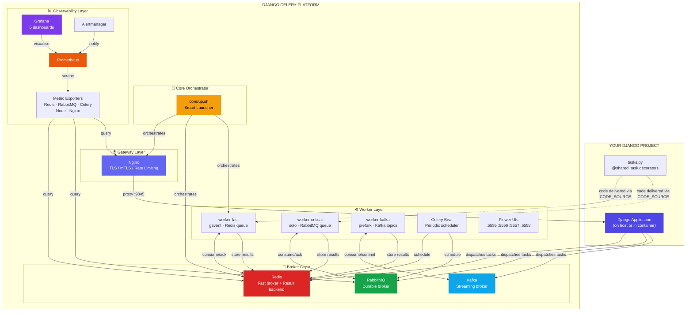

---

## 2. Six Configuration Dimensions

The platform is controlled by **six independent dimensions**, set as environment variables. Every combination produces a valid, tested stack.

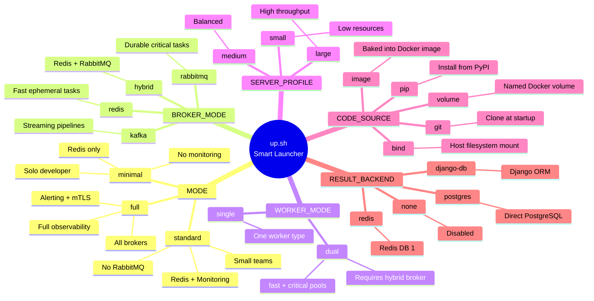

### Dimension Quick Reference

| Dimension | Variable | Options | Default | Controls |
|---|---|---|---|---|
| Deploy Mode | `MODE` | `minimal` · `standard` · `full` | `standard` | Which services boot |
| Broker Strategy | `BROKER_MODE` | `redis` · `rabbitmq` · `hybrid` · `kafka` | `redis` | Message routing |
| Worker Topology | `WORKER_MODE` | `single` · `dual` | `single` | Worker pool layout |
| Server Sizing | `SERVER_PROFILE` | `small` · `medium` · `large` | `medium` | Concurrency + memory |
| Code Delivery | `CODE_SOURCE` | `bind` · `image` · `volume` · `git` · `pip` | `bind` | How code reaches workers |
| Result Storage | `RESULT_BACKEND` | `redis` · `django-db` · `postgres` · `none` | `redis` | Task result persistence |

### Constraint Rules

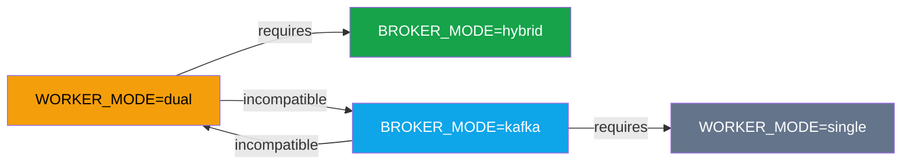

---

## 3. Three Broker Lanes

Each broker serves a **distinct workload pattern**. They are not interchangeable.

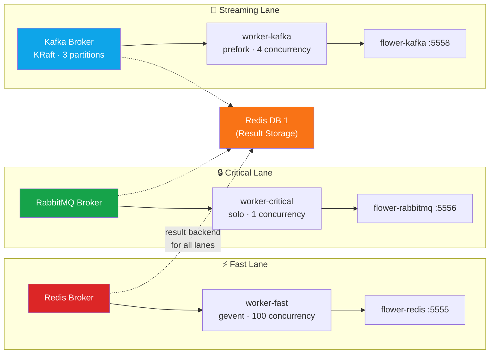

| Lane | Broker | Worker | Pool | Use Case |
|---|---|---|---|---|
| **Fast** | Redis | `worker-fast` | gevent | Notifications, cache warming, API calls, real-time push |
| **Critical** | RabbitMQ | `worker-critical` | solo | Payments, financial transactions, report generation |
| **Streaming** | Kafka | `worker-kafka` | prefork | Event ingestion, log aggregation, data pipelines |

---

## 4. Deploy Modes — What Boots When


---

## 5. `up.sh` — The Smart Launcher Flow

`core/up.sh` is the **only entry point**. It validates dimensions, loads compose fragments, and launches the stack.

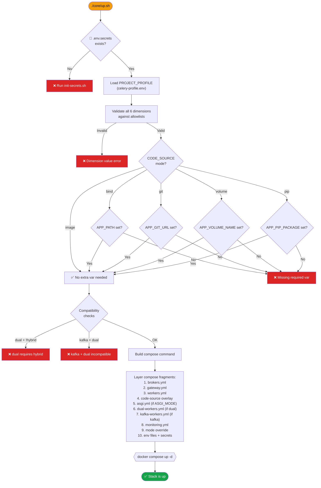

---

## 6. Compose File Layering

`up.sh` assembles a Docker Compose command from multiple fragments. This diagram shows **which fragments are loaded and when**.

```mermaid
graph TD
    subgraph "Always Loaded"
        B["brokers/<br/>docker-compose.brokers.yml"]
        G["gateway/<br/>docker-compose.gateway.yml"]
        W["workers/<br/>docker-compose.workers.yml"]
        M["observability/<br/>docker-compose.monitoring.yml"]
        MODE_F["modes/{MODE}.yml"]
        ENV1[".docker.env"]
        ENV2["PROJECT_PROFILE"]
        ENV3["sizing.{SERVER_PROFILE}.env"]
        ENV4["broker.{BROKER_MODE}.env"]
        ENV5["worker.{WORKER_MODE}.env"]
        ENV6[".env.secrets"]
    end

    subgraph "Conditional — CODE_SOURCE"
        CS_B["workers.code-bind.yml"]
        CS_V["workers.code-volume.yml"]
        CS_G["workers.code-git.yml"]
    end

    subgraph "Conditional — WORKER_MODE=dual"
        DW["dual-workers.yml"]
        DW_M["modes/dual-workers.yml"]
        DW_CS["dual-workers.code-*.yml"]
    end

    subgraph "Conditional — ASGI_MODE=true"
        ASGI["asgi.yml"]
        ASGI_CS["asgi.code-*.yml"]
    end

    subgraph "Conditional — BROKER_MODE=kafka"
        KW["kafka-workers.yml"]
        KW_M["modes/kafka-broker.yml"]
        KW_CS["kafka-workers.code-*.yml"]
    end

    W --> CS_B
    W --> CS_V
    W --> CS_G
    W --> DW
    DW --> DW_CS
    W --> ASGI
    ASGI --> ASGI_CS
    W --> KW
    KW --> KW_CS

    style B fill:#dc2626,color:#fff
    style G fill:#6366f1,color:#fff
    style W fill:#f59e0b,color:#000
    style M fill:#7c3aed,color:#fff
    style MODE_F fill:#64748b,color:#fff
```

---

## 7. Network Topology & Port Map

All containers share the `celery-broker-net` Docker network (`10.220.220.0/24`).

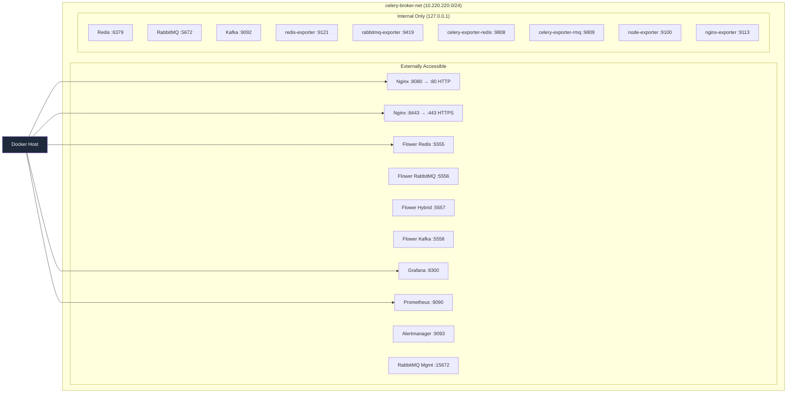

### Full Port Reference

| Port | Variable | Service | Binding | Overridable |
|---|---|---|---|---|
| `:8080` | `NGINX_HTTP_PORT` | Nginx HTTP | external | ✅ |
| `:8443` | `NGINX_HTTPS_PORT` | Nginx HTTPS | external | ✅ |
| `:5555` | `FLOWER_PORT_REDIS` | Flower Redis | `127.0.0.1` | ✅ |
| `:5556` | `FLOWER_PORT_RABBITMQ` | Flower RabbitMQ | `127.0.0.1` | ✅ |
| `:5557` | `FLOWER_PORT_HYBRID` | Flower Hybrid | `127.0.0.1` | ✅ |
| `:5558` | `FLOWER_PORT_KAFKA` | Flower Kafka | `127.0.0.1` | ✅ |
| `:8300` | `PORT_GRAFANA` | Grafana | `127.0.0.1` | ✅ |
| `:9090` | `PORT_PROMETHEUS` | Prometheus | `127.0.0.1` | ✅ |
| `:9093` | `PORT_ALERTMANAGER` | Alertmanager | `127.0.0.1` | ✅ |
| `:15672` | `PORT_RABBITMQ_MGMT` | RabbitMQ Management | `127.0.0.1` | ✅ |
| `:6379` | `PORT_REDIS` | Redis | `127.0.0.1` | ✅ |
| `:5672` | `PORT_RABBITMQ` | RabbitMQ AMQP | `127.0.0.1` | ✅ |
| `:9092` | `PORT_KAFKA` | Kafka | `127.0.0.1` | ✅ |
| `:9121` | `PORT_REDIS_EXPORTER` | Redis Exporter | `127.0.0.1` | ✅ |
| `:9419` | `PORT_RABBITMQ_EXPORTER` | RabbitMQ Exporter | `127.0.0.1` | ✅ |
| `:9808` | `PORT_CELERY_EXPORTER_REDIS` | Celery Exporter (Redis) | `127.0.0.1` | ✅ |
| `:9809` | `PORT_CELERY_EXPORTER_RABBITMQ` | Celery Exporter (RabbitMQ) | `127.0.0.1` | ✅ |
| `:9100` | `PORT_NODE_EXPORTER` | Node Exporter | `127.0.0.1` | ✅ |
| `:9113` | `PORT_NGINX_EXPORTER` | Nginx Exporter | `127.0.0.1` | ✅ |

---

## 8. CODE_SOURCE — How Code Reaches Workers

Workers need your Django project code to execute tasks. `CODE_SOURCE` controls how that code arrives.

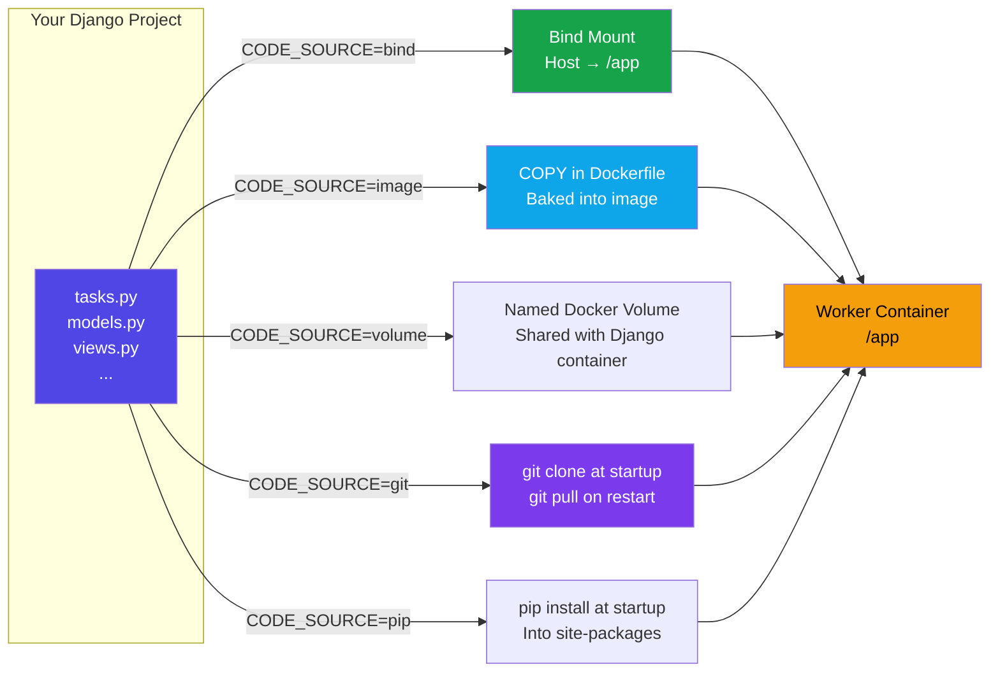

| Mode | Mechanism | Best For | Required Variable |
|---|---|---|---|
| `bind` | Host bind-mount at `/app` | Local dev, bare metal, systemd | `APP_PATH` |
| `image` | Baked into `WORKER_IMAGE` via `COPY` | CI/CD, production | — |
| `volume` | Named Docker volume at `/app` | Containerised Django | `APP_VOLUME_NAME` |
| `git` | `git clone` at startup, `git pull` on restart | Cloud, remote servers | `APP_GIT_URL` |
| `pip` | `pip install APP_PIP_PACKAGE` at startup | Packaged Django apps | `APP_PIP_PACKAGE` |

> [!WARNING]
> **The Multi-Project Scaling Challenge**
> This is exactly the kind of problem that shows why a single shared worker image doesn’t scale well across multiple Django projects. If two projects depend on the same library but require different versions, you’ll inevitably hit conflicts. Here are the main strategies to manage version mismatches:
> 
> **🔹 1. Per‑Project Worker Images (Recommended)**
> - Each project builds its own Celery worker image with its own `requirements.txt` or `poetry.lock`.
> - Workers connect to the shared Redis broker, but run in isolated containers.
> - This way, Project A can use Django==4.2 while Project B uses Django==5.0, without clashing.
> - CI/CD pipelines ensure each worker image is rebuilt with the correct dependencies.
> 
> **🔹 2. Queue Segregation**
> - Use separate queues per project in Redis.
> - Workers only subscribe to their project’s queue.
> - Prevents workers from accidentally consuming tasks from another project that might require incompatible dependencies.

---

## 9. Component Boundaries & Interface Contracts

Each component follows a strict **Interface Contract** (`INTERFACE.md`) ensuring isolation and preventing cross-module dependencies.

```mermaid
graph TB
    subgraph "components/gateway/"
        G_IF["INTERFACE.md"]
        G_COMP["docker-compose.gateway.yml"]
        G_CONF["nginx.conf.template"]
        G_TLS["ssl/ + scripts/"]
        G_TEST["tests/"]
    end

    subgraph "components/brokers/"
        B_IF["INTERFACE.md"]
        B_COMP["docker-compose.brokers.yml"]
        B_TEST["tests/"]
    end

    subgraph "components/workers/"
        W_IF["INTERFACE.md"]
        W_COMP["docker-compose.workers.yml<br/>+ dual-workers.yml<br/>+ kafka-workers.yml<br/>+ asgi.yml"]
        W_DOCK["Dockerfile.base<br/>.full · .mssql · .pdf · .smb"]
        W_CONF["config/<br/>broker_settings.py<br/>celery_config.py<br/>celery_hybrid.py<br/>django_celery_integration.py<br/>path_utils.py<br/>system_tasks.py"]
        W_STRAT["strategies/<br/>broker.*.env<br/>worker.*.env"]
        W_CODE["code-source overlays<br/>code-bind · code-volume · code-git"]
        W_TEST["tests/"]
    end

    subgraph "components/observability/"
        O_IF["INTERFACE.md"]
        O_COMP["docker-compose.monitoring.yml"]
        O_PROM["prometheus/<br/>prometheus.yml.template<br/>alert_rules.yml<br/>alertmanager.yml"]
        O_GRAF["grafana/provisioning/<br/>5 dashboards"]
        O_TEST["tests/"]
    end

    B_COMP -.->|"creates network"| NET["celery-broker-net"]
    G_COMP -.->|"joins"| NET
    W_COMP -.->|"joins"| NET
    O_COMP -.->|"joins"| NET

    style NET fill:#0ea5e9,color:#fff
    style G_IF fill:#f59e0b,color:#000
    style B_IF fill:#f59e0b,color:#000
    style W_IF fill:#f59e0b,color:#000
    style O_IF fill:#f59e0b,color:#000
```

| Component | Responsibility | Boundary Rule |
|---|---|---|
| **Gateway** | TLS termination, rate limiting, reverse proxy, WebSocket proxy | Must not depend on application logic |
| **Brokers** | Message queuing, global state, result storage | Must not depend on workers or monitoring |
| **Workers** | Task execution, code runtime, Flower monitoring | Parametric injection only; project-agnostic |
| **Observability** | Telemetry, dashboards, alerting | Passive observer; no impact on system if it fails |

> [!IMPORTANT]
> **Multi-Mode Ingress Strategy**
> The platform gateway layer is deliberately decoupled to support two distinct ingress modes. Deployment pipelines **must** explicitly choose their ingress strategy based on scale:
> 
> **🔹 1. Static Ingress (Nginx)**
> - **Best For:** Startups, single-team deployments, bare-metal servers, and local environments.
> - **Mechanism:** The built-in, pre-configured Nginx container provides rock-solid rate limiting, static TLS/mTLS termination, and straightforward WebSocket routing for a singular upstream group.
> - **Caution:** Extremely reliable but lacks dynamic reverse-proxying. If you need to route dozens of subdomains dynamically, maintaining static Nginx configurations becomes an anti-pattern.
> 
> **🔹 2. Dynamic Ingress (Traefik / Enterprise Gateways)**
> - **Best For:** Enterprise multi-tenant clusters, automated ephemeral CI/CD environments, and Kubernetes.
> - **Mechanism:** Bypass the generic Nginx components and attach an intelligent edge router like **Traefik**. Traefik hooks directly into Docker daemon labels or Kubernetes Ingress objects to automate `Host` routing, load balancing, and zero-downtime Let's Encrypt certificates.
> - **Caution (Security):** Relying on Docker socket listeners exposes the host to container breakout risks. **Always** deploy dynamic ingress controllers on dedicated edge networks using unprivileged read-only socket proxies, keeping your Celery workers and Redis databases strictly isolated in non-routable internal networks.

---

## 10. Docker Image Hierarchy

Workers use layered Docker images. Each layer adds a capability.

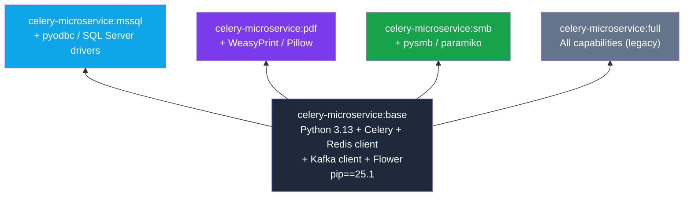

---

## 11. Observability Pipeline

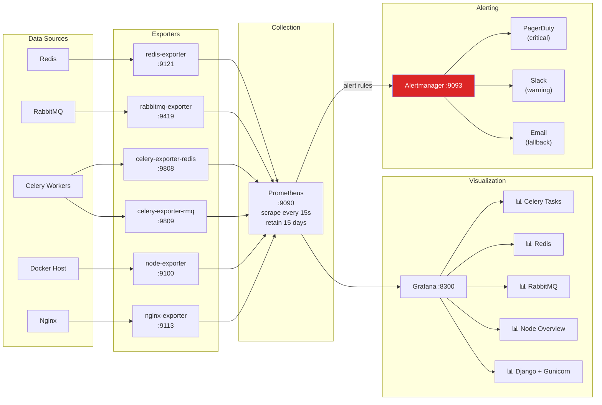

> [!TIP]
> **Enterprise Observability Recommendation**
> For this platform, we recommend keeping **Prometheus + Grafana** as the default tier (open-source, flexible, and fully self-hosted).
> 
> However, we offer **Datadog integration** as an optional enterprise module for teams that require SaaS-level APM and logging out of the box. 
> 
> **Per-Project Filtering Strategy:** If you share a cluster, it is critical to document the filtering strategy so teams only see their own metrics. Use **Grafana variables** (filtering by `Queue` or `namespace`) or **Datadog tags** (e.g., `project:alpha`) attached to the Celery workers and emitted metrics to achieve multi-tenant metric isolation.

---

## 12. Runtime Abstraction Layer

The platform detaches the **manifest format** from the **execution logic** through a runtime abstraction layer.

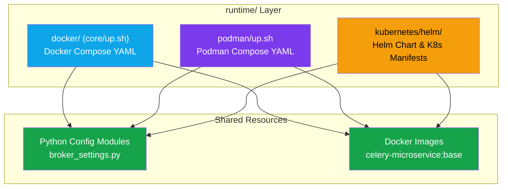

| Runtime | Adapter Path | Manifest Format | Autoscaling |
|---|---|---|---|
| **Docker** | `runtime/docker/` (pointer) | `docker-compose.yml` | Manual (`--scale`) |
| **Podman** | `runtime/podman/` (shim) | `docker-compose.yml` | Manual (`--scale`) |
| **Kubernetes** | `runtime/kubernetes/helm/` | Helm (Deployments, StatefulSets) | HPA / KEDA (Queue depth) |

> [!NOTE]
> All runtimes share the same Python configuration files inside the worker container (`components/workers/config/*`). This guarantees that regardless of orchestrator, application behaviour remains identical. When using Kubernetes, `CODE_SOURCE` is locked to `image`.

---

## 13. Complete Directory Structure

```text
django-celery-platform/
│
├── core/                                    # 🧠 Orchestration Brain
│   ├── up.sh                                #    The ONLY entry point
│   ├── modes/                               #    Deploy tier overrides
│   │   ├── minimal.yml                      #      Redis only, no monitoring
│   │   ├── standard.yml                     #      + Prometheus + Grafana
│   │   ├── full.yml                         #      Everything (all brokers + alerting)
│   │   ├── dual-workers.yml                 #      Scales celery-beat to 0 for dual mode
│   │   └── kafka-broker.yml                 #      Scales Redis/RMQ workers to 0 for Kafka
│   └── profiles/                            #    Server sizing
│       ├── sizing.small.env                 #      Low resource constraints
│       ├── sizing.medium.env                #      Balanced defaults
│       └── sizing.large.env                 #      High throughput
│
├── components/
│   ├── brokers/                             # 📨 Message Broker Layer
│   │   ├── INTERFACE.md                     #    Component contract
│   │   ├── CONTRIBUTING.md                  #    Contributor guide
│   │   ├── docker-compose.brokers.yml       #    Redis + RabbitMQ + Kafka
│   │   └── tests/                           #    Smoke tests
│   │
│   ├── gateway/                             # 🌐 Gateway Layer
│   │   ├── INTERFACE.md                     #    Component contract
│   │   ├── CONTRIBUTING.md                  #    Contributor guide
│   │   ├── docker-compose.gateway.yml       #    Nginx reverse proxy
│   │   ├── nginx.conf.template              #    Nginx config template
│   │   ├── ssl/                             #    TLS certificates
│   │   ├── scripts/                         #    Certificate generation scripts
│   │   │   ├── generate_mtls_certs.sh       #      Generate mTLS certs
│   │   │   └── import_mtls_certs.sh         #      Import certs
│   │   └── tests/                           #    Smoke tests
│   │
│   ├── workers/                             # ⚙️ Worker Layer
│   │   ├── INTERFACE.md                     #    Component contract
│   │   ├── CONTRIBUTING.md                  #    Contributor guide
│   │   ├── docker-entrypoint.sh             #    Container entrypoint (CODE_SOURCE dispatch)
│   │   │
│   │   ├── Dockerfile.base                  #    Python 3.13 + Celery + Flower
│   │   ├── Dockerfile.full                  #    All capabilities
│   │   ├── Dockerfile.mssql                 #    + SQL Server support
│   │   ├── Dockerfile.pdf                   #    + WeasyPrint / Pillow
│   │   ├── Dockerfile.smb                   #    + SMB / SSH support
│   │   │
│   │   ├── config/                          #    Reference Celery config modules
│   │   │   ├── broker_settings.py           #      URL builders + get_result_backend()
│   │   │   ├── celery_config.py             #      Host-side Celery apps
│   │   │   ├── celery_hybrid.py             #      Container-side multi-broker apps
│   │   │   ├── django_celery_integration.py #      Django-aware apps + autodiscover
│   │   │   ├── path_utils.py                #      CWE-22 hardened file I/O
│   │   │   └── system_tasks.py              #      Platform health tasks
│   │   │
│   │   ├── strategies/                      #    Broker/worker env selectors
│   │   │   ├── broker.redis.env             #      Redis-only strategy
│   │   │   ├── broker.rabbitmq.env          #      RabbitMQ-only strategy
│   │   │   ├── broker.hybrid.env            #      Redis + RabbitMQ strategy
│   │   │   ├── broker.kafka.env             #      Kafka strategy
│   │   │   ├── worker.single.env            #      Single worker topology
│   │   │   └── worker.dual.env              #      Dual worker topology
│   │   │
│   │   ├── docker-compose.workers.yml       #    Base workers (fast + critical + beat + flower)
│   │   ├── docker-compose.dual-workers.yml  #    Hybrid flower + hybrid beat
│   │   ├── docker-compose.kafka-workers.yml #    Kafka worker + kafka beat + kafka flower
│   │   ├── docker-compose.asgi.yml          #    Daphne + Channel Layer
│   │   │
│   │   ├── docker-compose.workers.code-bind.yml    # CODE_SOURCE overlays
│   │   ├── docker-compose.workers.code-volume.yml  #   for base workers
│   │   ├── docker-compose.workers.code-git.yml     #
│   │   ├── docker-compose.dual-workers.code-*.yml  #   for dual workers
│   │   ├── docker-compose.asgi.code-*.yml          #   for ASGI
│   │   ├── docker-compose.kafka-workers.code-*.yml #   for Kafka workers
│   │   │
│   │   ├── requirements/                    #    Python dependencies
│   │   │   ├── core.txt                     #      Celery + Redis + Kafka + Flower
│   │   │   ├── auth.txt                     #      Authentication packages
│   │   │   ├── mssql.txt                    #      SQL Server drivers
│   │   │   ├── pdf.txt                      #      PDF generation
│   │   │   └── smb.txt                      #      SMB/SSH packages
│   │   └── tests/                           #    Smoke tests
│   │
│   └── observability/                       # 📊 Monitoring Layer
│       ├── INTERFACE.md                     #    Component contract
│       ├── CONTRIBUTING.md                  #    Contributor guide
│       ├── docker-compose.monitoring.yml    #    Prometheus + Grafana + Exporters + Alertmanager
│       ├── prometheus/                      #    Prometheus configs
│       │   ├── prometheus.yml.template      #      Scrape config (envsubst)
│       │   ├── alert_rules.yml              #      Alert rule definitions
│       │   ├── alertmanager.yml             #      Alert routing (PagerDuty/Slack/Email)
│       │   └── docker-entrypoint.sh         #      envsubst runner
│       ├── grafana/provisioning/            #    Auto-provisioned dashboards
│       │   ├── dashboards/                  #      5 JSON dashboard definitions
│       │   │   ├── celery-tasks.json        #        Celery task metrics
│       │   │   ├── redis.json               #        Redis performance
│       │   │   ├── rabbitmq.json            #        RabbitMQ queues
│       │   │   ├── node-overview.json       #        Host system metrics
│       │   │   └── django-gunicorn.json     #        Django + Gunicorn
│       │   └── datasources/                 #      Prometheus data source config
│       └── tests/                           #    Smoke tests
│
├── demo/                                    # 🎮 Contributor Test Environment
│   ├── docker-compose.yml                   #    Self-contained demo stack
│   ├── config/                              #    Redis + RabbitMQ Celery apps
│   ├── demo_app/                            #    Tasks, views, WebSocket consumer
│   └── start.sh / start.bat                 #    Quick start scripts
│
├── docs/                                    # 📚 Documentation
│   ├── README.md                            #    Full deployment reference
│   ├── DEVELOPER_GUIDE.md                   #    Django integration guide
│   ├── ARCHITECTURE_DIAGRAM.md              #    This file
│   ├── UPGRADE.md                           #    Version migration guide
│   ├── FAILURE_MODES.md                     #    Platform triage guide
│   ├── KUBERNETES_PATH.md                   #    Scaling roadmap (Stages 2-5)
│   ├── STRATEGIC_POSITIONING.md             #    Architecture decisions
│   └── Additional_Works.md                  #    OSS modularity plan
│
├── .docker.env                              #    Non-secret defaults (safe to commit)
├── .env.secrets                             #    Generated secrets (NEVER commit)
├── .env.secrets.example                     #    Secrets template
├── .celery-profile.env.example              #    Project profile template
├── init-secrets.sh                          #    Zero-trust secrets generator
├── CHANGELOG.md                             #    Version history
├── LICENSE                                  #    MIT License
└── README.md                                #    Quick start guide
```

---

## 14. Typical Usage Flows

### Flow A — Solo Developer Quick Start

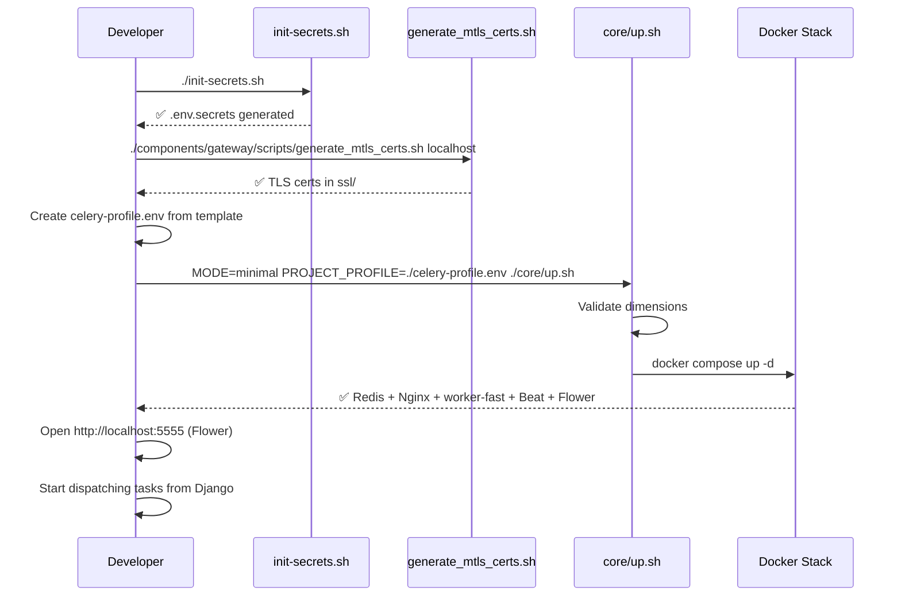

### Flow B — Production Hybrid Deployment

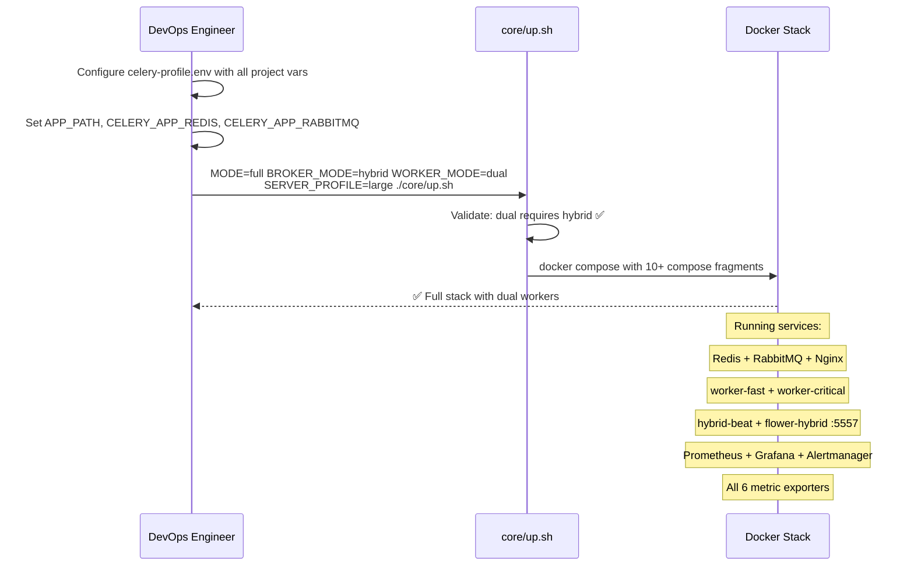

---

## 15. Container Naming Convention

| Container | Name Pattern | Example |
|---|---|---|
| Redis | `celery-redis-shared` | Shared infrastructure (fixed name) |
| RabbitMQ | `celery-rabbitmq-shared` | Shared infrastructure (fixed name) |
| Kafka | `celery-kafka-shared` | Shared infrastructure (fixed name) |
| Nginx | `celery-nginx-shared` | Shared infrastructure (fixed name) |
| Fast Worker | `<PROJECT_NAME>-worker-fast` | `myapp-worker-fast` |
| Critical Worker | `<PROJECT_NAME>-worker-critical` | `myapp-worker-critical` |
| Kafka Worker | `<PROJECT_NAME>-worker-kafka` | `myapp-worker-kafka` |
| Beat | `<PROJECT_NAME>-beat` | `myapp-beat` |
| Flower Redis | `<PROJECT_NAME>-flower-redis` | `myapp-flower-redis` |
| Flower RabbitMQ | `<PROJECT_NAME>-flower-rabbitmq` | `myapp-flower-rabbitmq` |
| Flower Hybrid | `<PROJECT_NAME>-flower-hybrid` | `myapp-flower-hybrid` |
| Flower Kafka | `<PROJECT_NAME>-flower-kafka` | `myapp-flower-kafka` |
| Prometheus | `prometheus-shared` | Shared observability |
| Grafana | `grafana-shared` | Shared observability |
| Alertmanager | `alertmanager-shared` | Shared observability |
| Exporters | `*-exporter-shared` / `celery-exporter-*` | Per-service metrics |

---

## 16. Security Model

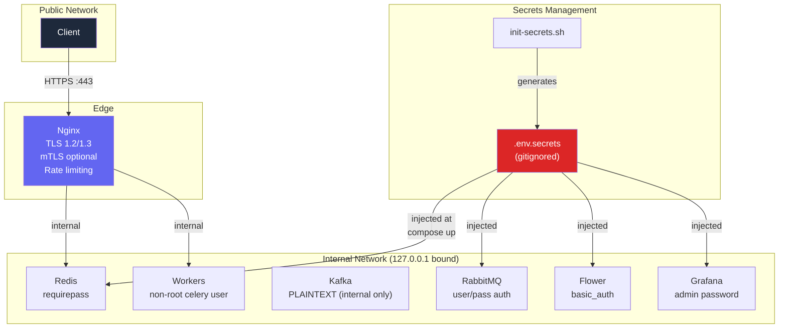

| Security Layer | Implementation |
|---|---|
| Network isolation | Internal ports bound to `127.0.0.1` only |
| Transport encryption | TLS 1.2/1.3 at Nginx; mTLS in `MODE=full` |
| Authentication | Redis `requirepass`, RabbitMQ user/pass, Flower `basic_auth`, Grafana admin |
| Process isolation | All workers run as non-root `celery` user |
| Secret management | `init-secrets.sh` generates cryptographic random passwords; `.env.secrets` is gitignored |
| Rate limiting | Configurable via `NGINX_RATE_LIMIT` (default: 10 req/s) |

---

**Version**: 3.1.0
**Project**: django-celery-platform
**Architecture**: Composable Monorepo Component Model
**Last Updated**: 2026-04
**License**: MIT — see LICENSE in the repository root
